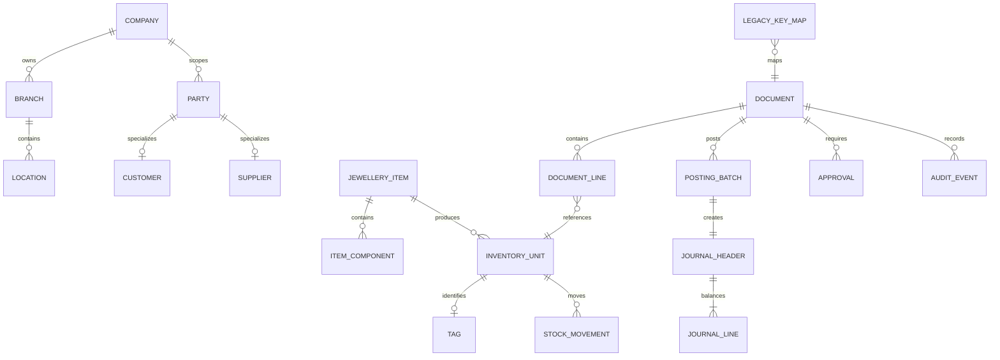

# INDUS Jewellery replacement traceability and gap register

This document reconciles the replacement-system blueprint supplied on
2026-10-02 with the current ECOM AE ASP.NET migration. It is a planning and
acceptance artifact, not proof that an unverified INDUS rule exists in PHP.
PHP tables, routes, formulas, permissions, and readback remain authoritative
until the corresponding gate is accepted.

## Decision boundary

The attachment requires a complete replacement architecture, but the current
program is an ERP-first PHP coexistence migration. Therefore:

- existing PHP-compatible screens and services are accepted only through the
  per-process `BUILD → TEST → ACCEPT → LOCK` gates;
- proposed normalized entities below are target architecture, not permission to
  create shadow tables over PHP-owned schemas;
- missing target architecture is recorded as a controlled gap or
  `POST-MIGRATION ENHANCEMENT` unless it is required for data integrity,
  security, accounting, or an already-scoped acceptance tranche;
- live tenants remain read-only for rehearsal and PHP fallback remains active.

## A–L first-deliverable status

| Deliverable | Current evidence | Status / next gate |
| --- | --- | --- |
| A. Complete module/menu tree | `module-function-inventory.json`, PHP/ASP.NET route catalogs, Jewellery plan | **Partial**: functional menu coverage exists; final screenshot and permission reconciliation remains open |
| B. Legacy-to-new field mapping | `evidence/jewellery/INDUS_LIVE_FIELD_AND_WORKFLOW_MAPPING.md`, PHP schema inspection | **Partial**: observed fields mapped; every transaction still needs field/action/validation/DB/report trace rows |
| C. Proposed database ERD | Target entities are described in the mapping and D365 audit | **Missing as a single artifact**; ERD below is now the canonical proposal |
| D. Transaction state machine | Per-process lifecycle gates and repair/purchase/fixing status contracts | **Partial**; common state contract below is target policy, while PHP-specific transitions require fixtures |
| E. Inventory movement architecture | Stock, tag, transfer, verification evidence and PHP ownership notes | **Partial**; immutable movement ledger is a target gap, not a new PHP table |
| F. Accounting posting architecture | `ErpGlPostingService`, GL journal/line readback, finance workspace | **Partial**; central posting rules and full Jewellery source-to-posting matrix remain open |
| G. Role/permission matrix | ERP RBAC, capability windows, company/site scope, audit | **Partial**; Jewellery AML/cost/margin/backdate permissions need explicit acceptance |
| H. Reporting catalogue | PHP/ASP.NET report inventories and Jewellery history projections | **Partial**; drill-down/export/print parity is not accepted for every report family |
| I. Migration/reconciliation strategy | tenant safety, PHP decommission, ERP acceptance and Jewellery plans | **Present**; Jewellery stock/WIP/consignment reconciliation needs executable fixtures |
| J. Automated testing strategy | contract tests, focused service tests, throwaway rehearsal skill | **Partial**; golden transaction scenarios need stock + accounting + tax + audit + reversal assertions |
| K. Screenshot/Excel gap list | visual parity matrix, field mapping, acceptance board, and the supplied `INDUS_LIVE_Maximum_Fields_Legacy_Style_ERP_2.xlsx` | **Present and expanded below**; workbook fields are evidence of the requested legacy-style surface, not proof of PHP schema or accepted behavior |
| L. Revised roadmap and measurable gates | ERP completion directive and Jewellery completion plan | **Present**; this document adds dependency order and target architecture gates |

## Supplied workbook reconciliation

The workbook is **consistent with the Jewellery scope and direction**, but it is
more concrete and broader than the earlier attachment set. It supplies a
legacy-style menu and field catalogue for 15 surfaces:

1. Account Master
2. POS Customer
3. Metal Purchase
4. POS Sale
5. Branch Transfer
6. Manufacture
7. Journal Voucher
8. Metal Stock Balance
9. Employee Master
10. Metal Master
11. Diamond Master
12. Daily Rates
13. Stock Ledger
14. Trial Balance
15. Dashboard

The following areas match the existing plan directly:

| Workbook evidence | Existing plan/traceability match | Reconciliation result |
| --- | --- | --- |
| Metal/karat/rate master | Metal, karat, rate type, currency and daily-rate mapping | **Aligned**; effective-date, branch, status and rate snapshots remain acceptance fields |
| Diamond/stone master | Stone, pearl, diamond, design and component linkage | **Aligned**; certificate, lot, supplier, cost/ct, price/ct and picture fields are now explicit workbook requirements |
| Metal purchase/fixing | Purchase, fixing, supplier, purity, pure weight, FC/LC and VAT | **Aligned**; settlement, approval, posting and attachment fields remain open behavior gates |
| POS sale | Tagged sale, karat/rate, customer, VAT and return | **Aligned but incomplete**; tender, multiple currencies, scheme redemption, tourist refund, due and limited-edit behavior need end-to-end proof |
| Branch transfer | Branch/location movement and measured stock values | **Aligned**; receipt, in-transit, source links, differences and posting behavior remain open |
| Manufacture | BOM/component, tag, cost/price, metal/stone/other tabs | **Aligned but incomplete**; WIP, pure-weight, wastage/loss, component issue and finished-tag posting remain open |
| Journal voucher/trial balance | Balanced FC/LC finance and reporting architecture | **Aligned**; PHP account mappings, VAT lines, allocation, party, cost centre and report drill-down remain open |
| Metal stock balance/stock ledger | Stock balance, ledger, verification, branch/location and tag identity | **Aligned but incomplete**; universal immutable movement/reversal and full filter/export/print parity remain open |
| Account master/POS customer | Party, customer, supplier, KYC/AML, credit and commercial controls | **Partially aligned**; workbook adds credit limits, gold-unfix limits, margin, identity, sanctions, approval and account-control fields not yet accepted end-to-end |
| Employee master | Salesman/operator/organization scope | **Partially aligned**; salary, immigration, leave, WPS and pay-component tabs are new workbook evidence and are not Jewellery acceptance scope unless PHP references confirm them |
| Dashboard | Management KPIs and workflow chain | **Aligned as a presentation target**; live KPI source, drill-down and reconciliation remain unaccepted |

### Newly explicit workbook field requirements

The workbook adds field-level requirements that were only implicit or absent in
the earlier mapping:

- **Account controls:** trade debtor/creditor mode, credit limits in LC and
  gold-unfix grams, credit days, margins, interest, brokerage, account hold,
  allocation, cash-account flag, transaction dates, trade licence/TRN and
  banking details.
- **Customer/KYC/AML:** government ID and expiry, nationality, customer risk,
  approval state, KYC state, sanctions names/passports/DOBs, AKA, related
  persons and risk result.
- **Sale/tender:** stock code plus tag/barcode, measured weights, cost/margin,
  tender mode/currency/rate, bank/card reference, approval number, gold-scheme
  redemption, adjusted return, VAT rounding, due, attachments and limited-edit
  status.
- **Transfer:** source/destination locations, in-transit state, purchase and
  batch references, purity/stone differences, sales-return transfer and
  attachment links.
- **Manufacture:** classification, tag/barcode, five price tiers, cost centre,
  component sequence/IDs, metal/stone/other component tabs, issue location,
  batch, supplier reference, setting type and picture references.
- **Finance/reporting:** VAT debit/credit totals, allocation references,
  opening/period/closing balances, stock-ledger movement directions, report
  filters, valuation switches, zero-quantity controls, in-transit/repair
  inclusion and output template.
- **Operations:** employee organization, immigration/leave/salary tabs and
  pay-component lines.

These are **field-catalogue requirements**, not authorization to create shadow
tables. Each field must be mapped to an observed PHP column, existing PHP
remark/JSON contract, or an explicitly approved post-migration enhancement.

### Workbook-specific gaps added to the acceptance board

- No complete PHP-to-workbook field/action/validation/report trace exists yet
  for all 15 sheets.
- Account Master and POS Customer KYC/AML/credit-control behavior is not
  fully accepted through native UI, SQL/audit, permission and negative-path
  evidence.
- POS tender, scheme redemption, old-gold exchange, tourist VAT refund,
  multiple-currency settlement, adjusted return and limited-edit controls
  remain open.
- Manufacture's full component tabs, tag creation, WIP/pure-weight/loss
  reconciliation, price tiers and finished-stock posting remain open.
- Branch transfer receipt/in-transit and purity/stone-difference behavior
  remain open.
- Stock Ledger, Trial Balance and Dashboard need populated-source drill-down,
  filter, export/print and reconciliation evidence rather than shell/readback
  claims.
- Employee Master salary/immigration/leave evidence is present in the workbook
  but its inclusion in the ERP Jewellery migration must first be confirmed
  against PHP ownership and scope.

## Target ERD (proposal, not PHP schema)



Minimum proposed invariants:

1. `CompanyId`, `BranchId`, `LocationId`, and `FinancialYearId` are explicit
   on every posted stock or accounting source.
2. `InventoryUnit` keeps item code, stock code, tag/barcode, batch/lot,
   gross weight, stone weight, net metal weight, purity, pure weight, carat,
   and valuation distinct.
3. `StockMovement` is append-only; corrections reference a reversal movement.
4. `JournalHeader` cannot post unless debits equal credits in LC.
5. `LegacyKeyMap` preserves every imported PHP/INDUS identifier and source
   system.

## D. Common transaction lifecycle

```text
Draft
  -> Submitted (validation, dimensions, period, permissions)
  -> Approved (when approval policy requires it)
  -> Posted (atomic stock/tax/accounting/audit effects)
  -> Reversed (controlled compensating document)
  -> Cancelled (only before posting, with reason and audit)
```

PHP may use different labels or fewer states for a specific module. The
ASP.NET implementation must preserve the PHP transition and expose the richer
state only when the source behavior and acceptance evidence support it.

## E. Inventory movement architecture

The target movement record is:

```text
MovementId, CompanyId, BranchId, FinancialYearId,
SourceDocumentType, SourceDocumentId, SourceLineId,
ItemId, InventoryUnitId/TagId,
FromLocationId, ToLocationId,
Qty, GrossWeight, StoneWeight, NetWeight, Purity, PureWeight, StoneCarat,
CostValueFC, CostValueLC, CurrencyId, ExchangeRate,
EventTime, PostedBy, ReversalMovementId
```

Jewellery acceptance must prove both the physical-unit path (tag/barcode) and
the measured-metal path (PCS/gross/stone/net/pure weight). The current
throwaway rehearsals prove selected PHP-owned writes and readback; they do not
yet prove a universal immutable movement ledger or manufacture/WIP
reconciliation.

## F. Accounting posting architecture

The target posting pipeline is:

```text
PostedDocument
  -> PostingRulesEngine
  -> PostingBatch
  -> JournalHeader
  -> JournalLines
  -> AuditEvent
```

Required line context is account, debit/credit, FC/LC amount, currency,
exchange rate, branch, cost centre, party, tax code, source document/line,
allocation reference, and narration. Candidate mappings such as POS sale and
purchase in the attachment remain **open** until matched to PHP account
configuration and a balanced throwaway fixture.

## G. Role and permission matrix

| Capability | Operator | Sales | Inventory | Finance | Approver | Auditor |
| --- | --- | --- | --- | --- | --- | --- |
| View operational records | scoped | scoped | scoped | scoped | scoped | scoped |
| Create/edit draft | yes | sales | inventory | finance | no | no |
| Submit | yes | sales | inventory | finance | no | no |
| Approve/post | no | no | no | policy | approved scope | no |
| Reverse/cancel | no | pre-post only | controlled | finance | approved scope | no |
| View cost/margin | policy | policy | policy | yes | policy | policy |
| View AML/KYC | no | masked | no | no | approved scope | approved scope |
| Backdate/reopen period | no | no | no | no | explicit grant | no |
| Export/print | scoped | scoped | scoped | scoped | scoped | yes |

This matrix is a target control contract. Actual grants must remain
company/branch/location/module/action scoped and be corroborated by audit
readback.

## H. Reporting catalogue

Required Jewellery report families:

- metal stock balance and metal stock ledger;
- diamond/stone stock and own-versus-consignment;
- branch/location/in-transit/repair stock;
- stock verification and variance;
- sales, POS collection, salesman, customer and supplier statements;
- account position, trial balance, P&L, balance sheet and VAT;
- purchase, fixing, manufacture, wastage/purity-difference and tag history;
- audit trail, document register and management dashboard.

Each report gate is `View → Filter → Drill down → Export Excel → PDF/Print`
where the PHP reference supports that action. Sample rows are never reported
as populated live-source parity.

## J. Golden test strategy

The minimum scenario suite is:

1. purchase and purchase fixing;
2. manufacture with metal/stone/other components and approved loss;
3. branch/location transfer and receipt;
4. stock verification and adjustment;
5. POS sale, multiple tenders and sale return;
6. old-gold exchange and scheme redemption;
7. receipt, payment and journal voucher;
8. repair receipt → transfer → workshop receive → delivery;
9. period close and controlled reversal.

Every scenario must assert document result, stock result, accounting result,
tax result, audit result, negative path, retry behavior, and reversal where
the PHP process supports it. Browser, second-database isolation, recovery,
UAT, and production gates remain separate from service tests.

## K. Current concrete gap list

The attachment identifies requirements that are not yet accepted in the
current migration:

- no single accepted ERD-backed universal `StockMovement`/reversal ledger;
- manufacture component/WIP/pure-weight loss reconciliation remains open;
- complete Jewellery POS, old-gold, scheme, tender/refund, and sale-return
  accounting parity remains open;
- customer KYC/AML field, permission, attachment, and approval parity remains
  open;
- common posting-rules engine coverage across Jewellery source documents
  remains incomplete;
- repair receipt → transfer → workshop receive → delivery persistence is now
  evidenced on throwaway data, but browser, audit, reversal, isolation,
  recovery, UAT, and production gates remain open;
- report filter/drill/export/print parity is not accepted for every listed
  report family;
- the supplied workbook now provides the field catalogue, but the
  PHP-to-workbook field/action/validation/report trace is still open for all
  15 sheets;

These are acceptance gaps, not authorization to invent PHP columns or migrate
live data.

## L. Dependency-ordered roadmap

1. **Foundation:** organization scope, period control, permissions, audit,
   numbering, shared workspace, and source-document links.
2. **Inventory truth:** normalized item/tag identity, measured quantities,
   movement/reversal contract, stock verification, and branch/location scope.
3. **Manufacturing:** component BOM, issue/WIP/receipt, pure-weight
   reconciliation, wastage approval, and cost/price snapshots.
4. **Commercial:** purchase/fixing, POS/tenders/returns, old-gold and schemes.
5. **Repair/service:** complete lifecycle, additions/removals, karigar,
   charges, delivery, reversal, and status reporting.
6. **Accounting/reporting:** centralized posting rules, balanced journals,
   VAT, statements, stock/finance reports, and export/print parity.
7. **Migration:** LegacyKeyMap, trial-balance/customer/supplier/cash/metal/
   diamond/tag/WIP/consignment/in-transit reconciliation.
8. **Acceptance:** native/browser UI, negative paths, SQL/audit readback,
   second physical tenant DB, recovery/rollback, UAT, and release-owner
   production approval.

No module is marked accepted from route or page existence alone.
