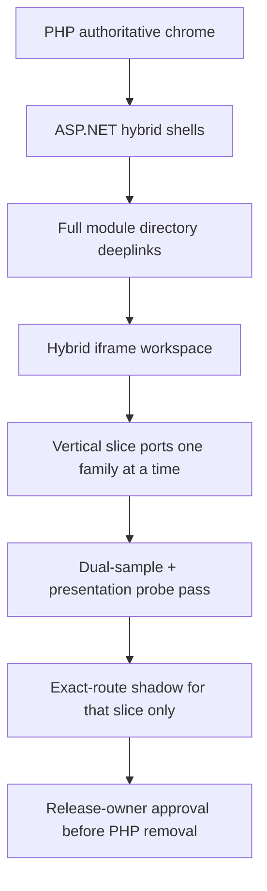

# PHP-level full parity plan (CP / ERP / BOS / frontend)

**Goal:** Bring ASP.NET presentation and functionality in line with live PHP for Control Panel, ERP, BOS, and storefront — design, style, presentation, and every module — without breaking live tenants and without broad nginx cutover.

**Hard rules**
- PHP remains authoritative for product chrome on live hosts until dual-sample parity + human `RELEASE_OWNER_APPROVAL.md`.
- Exact-route shadows only (`location =`). Never broad `/`, `/cp`, `/erp`, `/bos`, `/api`, `/storefront`.
- Tenant/industry vhosts stay PHP (see `TENANT_MIGRATION_SAFETY.md`).
- Digests ≠ interactive module parity. Weighted Zero-PHP meter ≠ chrome readiness.
- **Same-to-same / invisible migration:** tenants must not feel PHP→ASP.NET. Frontend, backend, CP, ERP, BOS, storefront UI/UX must look and work the same — digests/Blazor previews never replace live tenant product chrome.
- **Graphical presentation is in scope every batch:** hero banners, orbit/hub logos, particle/matrix backgrounds, piston/engine animations, glow/rings, and PHP CSS/JS that drive them — not structure-only shells. Prefer reusing live PHP CSS/JS class trees over inventing replacements.

## Inventory (source of truth)

Generated by `python3 scripts/generate_php_module_catalog.py`:

| Surface | Tracked items | ASP.NET interactive complete |
| --- | ---: | ---: |
| CP brochure features | **405** | **0** |
| ERP categories | **9** | **0** |
| ERP areas | **35** | **0** |
| ERP tabs | **154** | **0** |
| BOS modules | **99** unique (PHP sidebar ~116 incl. pack variants) | **0** |
| Storefront surfaces | **12** commerce entry points | **0** |

Catalog artifacts:
- `aspnet/.../Presentation/Generated/PhpModuleCatalog.g.cs`
- `aspnet/.../Presentation/Generated/php_module_catalog.json`
- `GET /migration/php-module-catalog`

## Strategy: hybrid → vertical slice → cutover



### Batch 0 — Directory completeness ✅ (merged #657)
- Generate full PHP module catalogs (CP/ERP/BOS/SF).
- Surface them on `/cp/app`, `/erp/app`, `/bos/app`, `/storefront/app` (searchable directory + hybrid workspace iframe).
- Match fonts (Open Sans / PT Sans / Fraunces+Sora / Inter+JetBrains) and storefront GA4 (+ Clarity hook).
- **Outcome:** nothing is missing from navigation; every module reachable via PHP deeplink under ASP.NET chrome.

### Batch 1 — Presentation chrome parity (login + shell assets) ✅ (merged #658)
- `PhpSurfaceHead` injects PHP webfonts/CSS/analytics into `<head>` (HeadOutlet) for all login/shell routes.
- Enrich `/cp|/erp|/bos|/storefront/login` with PHP login CSS + module cards/deeplinks.
- Probe compares chrome-asset markers (fonts/CSS/gtag); soft size warnings until Batch 2 desktops.
- Operator: redeploy + presentation shadows + `bash scripts/cloudpanel_probe_php_presentation_parity.sh`.
- Keep product `/CP/ /ERP/ /BOS/ /` on PHP.

### Batch 2 — Authenticated chrome structure ✅ (merged #659)
| Surface | PHP source | ASP.NET desktop chrome | Status |
| --- | --- | --- | --- |
| CP | `desktop.php` `#header` + `epc-cp-topnav` mega | `PhpCpDesktopChrome` + `CpCommandCentreApp` | ✅ |
| ERP | `erp_desktop` topbar + `epc-erp-topnav` | `PhpErpDesktopChrome` + `ErpBosDashboardApp` | ✅ |
| BOS | `bos/index.php` `bos-topnav` + `bos-main` | `PhpBosDesktopChrome` + `BosFleetApp` | ✅ |
| Storefront | Modex header/search/nav | `PhpStorefrontDesktopChrome` + `StorefrontPreviewApp` | ✅ |

- Mega-panel groupings: `LegacyDesktopChromeCatalog` (CP brochure groups, ERP category→area tabs, BOS keyword sections).
- Authenticated shells wrap hybrid directory + `?php=` iframe inside PHP-class desktop chrome.
- Module bodies remain PHP deeplinks until Batch 4 vertical slices.
- Probes may lift structural selectors (`#header`, `.epc-cp-topnav`, `.bos-topnav`, `.epc-erp-topnav`) but must **not** claim `readyForPhpRemoval`.
- BOS: admin-cookie digests ≠ PHP `$_SESSION` — full tenant module UX stays on `/BOS/`.

### Batch 3 — Login bridge hardening + graphical login/hero parity ✅ (merged #660)
- Host: `EcomAE__SecretSuccession` (= PHP `secret_succession`); verify with `scripts/cloudpanel_verify_secret_succession_configured.sh` (never prints value).
- Customer mint formula fixed to PHP `md5(contact+userId+time+secret)` + `last_activiti_time`; CSRF IP prefers `X-Forwarded-For`.
- Dual-sample cookie harness: `scripts/cloudpanel_capture_login_cookie_dual_samples.sh` + `scripts/compare_login_cookie_dual_samples.py` → `docs/migration/evidence/login-session-bridge/` (`cutoverAllowed=false`).
- Social/demo/shared-ERP picker / rate-limit / password upgrade remain PHP.
- **Decision locked:** keep `/BOS/` PHP-authoritative for native `$_SESSION` modules; `/bos/login` is admin-cookie bridge for digests/`/bos/app` only.
- **Graphical (do not skip):**
  - CP/ERP login: `PhpEcomaeHubLogo` (`.ech-hub` orbit) + login hero CSS/particles
  - BOS login: PHP `.bos-login__bg` / `#bosParticles` / glows / brand rings + `epc_bos_shell.js`
  - Storefront `/storefront/app`: `PhpAspPistonBanner` (`.epc-engine-animation`) + `epc_automotive_spareparts.css` + `data-epc-industry` / `data-epc-storefront` attrs
  - Live homepage slider media remains PHP-authoritative on epartscart.com

### Batch 4 — Vertical module slices (one family → exact-route) ← current
Priority order:
1. **CP Orders/OMS (read UI first; writes PHP)** ✅ (#661): `/cp/orders` + `/cp/orders-digest`
2. **CP Users/Groups** ✅ (#662): digests stay `/cp/users` + `/cp/groups`; Blazor UI at `/cp/users-app` + `/cp/groups-app`
3. **ERP sales orders tab family** ✅ (#663): `/erp/sales-orders-app` over `/erp/sales-orders` digest; PHP writes authoritative
4. **Storefront search results** ✅ (#664): `/storefront/search-app` read-only warehouse offers; PHP `/shop/part_search` authoritative for tabs
5. **Cart/checkout** ✅ (#665): `/storefront/cart-app` authenticated cart summary; qty/guest cart/checkout remain PHP `/shop/cart` + `/shop/checkout/*`

Each slice requires: Blazor/HTML shell + API + dual-sample evidence + `location =` only. Keep PHP hero/animation/graphical class trees when the surface has them.

### Batch 5 — Catalog miss / UMAPI ✅ (#666–#667)
- Cache-hit paths already live (18/18 exact-routes).
- miss-path probe + dual-sample harness ✅ (#666): `cloudpanel_probe_catalog_miss_path.sh` + evidence under `catalog-miss-umapi/`.
- Miss-fill worker dry-run ✅ (#667): `catalog-miss-fill` / `CatalogMissFillDryRunExecutor` — outbound/writes blocked.
- Live UMAPI outbound fill remains **PHP-authoritative**.

### Same-to-same tenant lock ✅ (#668)
- Invisible migration law + operator verify (`cloudpanel_verify_tenant_hosts_still_php.sh`).
- Digests/Blazor previews never replace live tenant product chrome.

### Hybrid ERP tab family continue
- ✅ Core ERP list digests have Blazor `*-app` through purchases (#676).

### Hybrid CP continue
- ✅ Users/Groups · Orders · Modules · Pages · Menus · Tenants · Currencies · Storages · Admin-sessions · API clients · Config-items · dashboard-summary-app

### Hybrid storefront continue
- ✅ Search · Cart · Orders (#687) · Garage (#688) · Profile (#689) · Account-summary (#691)
- Exact-route www preview only — live epartscart.com / tenant storefronts stay PHP (same-to-same).
- Destination: ASP.NET Core 10 Enterprise BOS; Blazor SSR is interim hybrid presentation (target SPA Angular/React later).

### Hybrid ERP continue
- ✅ Core ERP list digests through purchases + inventory-stock + accounts/dashboard-summary + cash-accounts/entries apps
- Exact-route www preview only — tenant ERP stays PHP (same-to-same).

### Hybrid BOS continue
- ✅ Audit-log-app; fleet KPIs on `/bos/app`; tenants/health/readiness/summary apps
- Exact-route www preview only — native `/BOS/` session stays PHP.

### Dual-sample evidence packs for hybrid UIs
- dual-sample evidence packs for hybrid UIs ✅ (#690): `cloudpanel_capture_hybrid_ui_dual_samples.sh` + `compare_hybrid_ui_dual_samples.py` + evidence under `hybrid-ui-dual-samples/` (`cutoverAllowed=false`).
- ✅ Hybrid surface digest `*-app` wave complete on tip (#692–#700 stack): every tracked CP/ERP/BOS/storefront digest has a www exact-route Blazor preview.
- Next: CloudPanel operator live captures (admin/customer cookies + `ECOMAE_OVERWRITE_HYBRID_UI_SAMPLES=1`) after presentation shadows; keep tenant verify `cutoverAllowed=false`.
- Stubs are CI floor only — never invent live pass results or `RELEASE_OWNER_APPROVAL.md`.

### Enterprise BOS scaffolding continue ← current
- ✅ TenantRegistry/Identity stubs + YARP design example + ActivitySource Data (#701)
- ✅ ERP cash EF stubs + Redis options + YARP nginx sync + Auth/Surfaces activities (#702)
- ✅ Kafka/OpenSearch/Serilog options + Workers ActivitySource (#703)
- ✅ Object storage + Vault options (#704)
- ✅ Postgres/Helm/OAuth/SPA options + consolidated options example (#705)
- ✅ YARP surface-digests + RabbitMQ/Polly + dual-sample operator helper (#706)
- ✅ YARP storefront/catalog-api + GraphQL/gRPC/blockchain/rate-limit (#707)
- ✅ GitOps/ArgoCD design + workers Helm example + Native AOT + AI-sidecar scaffolds (unwired) (#708)
- **This PR:** Enterprise BOS scaffold guardrails (options validator + Program.cs/YARP/Helm unwired checks + platform.env.example disabled keys)
- Still not live: K8s apply, worker writes, Native AOT platform host, AI business writes

### Batch 6 — Decommission gate (**blocked / premature**)
Do **not** start Batch 6 cutover while interactive `aspnet-complete` is still 0 and tenants must remain same-to-same on PHP chrome.
- Presentation recheck `status=pass` (not yet)
- Module function evidence (`MODULE_FUNCTION_PARITY_PASS`) (not yet)
- `bash scripts/cloudpanel_verify_tenant_hosts_still_php.sh` → `status=pass`
- Staging smoke + human `RELEASE_OWNER_APPROVAL.md`
- Never invent `RELEASE_OWNER_APPROVAL.md`

## Operator verify (CloudPanel)

```bash
set -a; source /etc/ecomae-aspnet/platform.env; set +a
cd /opt/ecomae-aspnet-source
git fetch origin main && git checkout -f main && git reset --hard origin/main
# or this PR branch during review
bash scripts/cloudpanel_find_and_redeploy.sh
ECOMAE_CONFIRM_INSTALL_PRESENTATION_APP_SHADOWS=YES \
  bash scripts/cloudpanel_install_presentation_app_shadows.sh
curl -sS https://www.ecomae.com/migration/php-module-catalog | head
bash scripts/cloudpanel_probe_php_presentation_parity.sh
bash scripts/cloudpanel_verify_tenant_hosts_still_php.sh
```

## Definition of done (PHP-level)

A surface is PHP-level only when:
1. Design/style/fonts/analytics match live PHP (probe pass),
2. Every module in the PHP inventory is either `aspnet-complete` or explicitly hybrid with working PHP deeplink,
3. Interactive create/read/update paths have functional evidence (not digests alone),
4. Exact-route cutover (if any) has dual-sample parity,
5. Live tenants remain unaffected.
