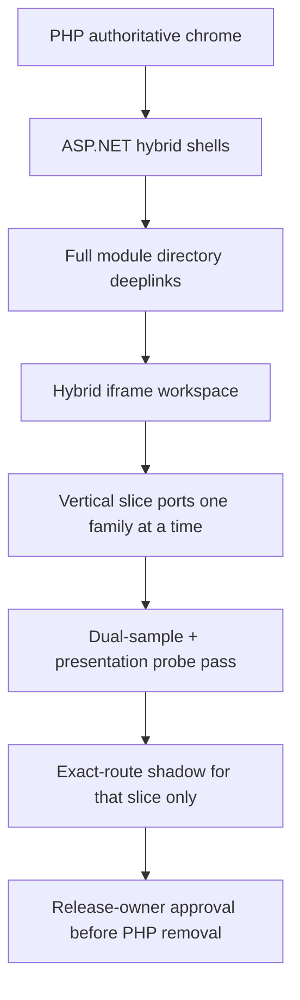

# PHP-level full parity plan (CP / ERP / BOS / frontend)

**Goal:** Bring ASP.NET presentation and functionality in line with live PHP for Control Panel, ERP, BOS, and storefront — design, style, presentation, and every module — without breaking live tenants and without broad nginx cutover.

**Hard rules**
- PHP remains authoritative for product chrome on live hosts until dual-sample parity + human `RELEASE_OWNER_APPROVAL.md`.
- Exact-route shadows only (`location =`). Never broad `/`, `/cp`, `/erp`, `/bos`, `/api`, `/storefront`.
- Tenant/industry vhosts stay PHP (see `TENANT_MIGRATION_SAFETY.md`).
- Digests ≠ interactive module parity. Weighted Zero-PHP meter ≠ chrome readiness.

## Inventory (source of truth)

Generated by `python3 scripts/generate_php_module_catalog.py`:

| Surface | Tracked items | ASP.NET interactive complete |
| --- | ---: | ---: |
| CP brochure features | **405** | **0** |
| ERP categories | **9** | **0** |
| ERP areas | **35** | **0** |
| ERP tabs | **154** | **0** |
| BOS modules | **99** unique (PHP sidebar ~116 incl. pack variants) | **0** |
| Storefront surfaces | **12** commerce entry points | **0** |

Catalog artifacts:
- `aspnet/.../Presentation/Generated/PhpModuleCatalog.g.cs`
- `aspnet/.../Presentation/Generated/php_module_catalog.json`
- `GET /migration/php-module-catalog`

## Strategy: hybrid → vertical slice → cutover



### Batch 0 — Directory completeness ✅ (merged #657)
- Generate full PHP module catalogs (CP/ERP/BOS/SF).
- Surface them on `/cp/app`, `/erp/app`, `/bos/app`, `/storefront/app` (searchable directory + hybrid workspace iframe).
- Match fonts (Open Sans / PT Sans / Fraunces+Sora / Inter+JetBrains) and storefront GA4 (+ Clarity hook).
- **Outcome:** nothing is missing from navigation; every module reachable via PHP deeplink under ASP.NET chrome.

### Batch 1 — Presentation chrome parity (login + shell assets) ✅ (merged #658)
- `PhpSurfaceHead` injects PHP webfonts/CSS/analytics into `<head>` (HeadOutlet) for all login/shell routes.
- Enrich `/cp|/erp|/bos|/storefront/login` with PHP login CSS + module cards/deeplinks.
- Probe compares chrome-asset markers (fonts/CSS/gtag); soft size warnings until Batch 2 desktops.
- Operator: redeploy + presentation shadows + `bash scripts/cloudpanel_probe_php_presentation_parity.sh`.
- Keep product `/CP/ /ERP/ /BOS/ /` on PHP.

### Batch 2 — Authenticated chrome structure ✅ (merged #659)
| Surface | PHP source | ASP.NET desktop chrome | Status |
| --- | --- | --- | --- |
| CP | `desktop.php` `#header` + `epc-cp-topnav` mega | `PhpCpDesktopChrome` + `CpCommandCentreApp` | ✅ |
| ERP | `erp_desktop` topbar + `epc-erp-topnav` | `PhpErpDesktopChrome` + `ErpBosDashboardApp` | ✅ |
| BOS | `bos/index.php` `bos-topnav` + `bos-main` | `PhpBosDesktopChrome` + `BosFleetApp` | ✅ |
| Storefront | Modex header/search/nav | `PhpStorefrontDesktopChrome` + `StorefrontPreviewApp` | ✅ |

- Mega-panel groupings: `LegacyDesktopChromeCatalog` (CP brochure groups, ERP category→area tabs, BOS keyword sections).
- Authenticated shells wrap hybrid directory + `?php=` iframe inside PHP-class desktop chrome.
- Module bodies remain PHP deeplinks until Batch 4 vertical slices.
- Probes may lift structural selectors (`#header`, `.epc-cp-topnav`, `.bos-topnav`, `.epc-erp-topnav`) but must **not** claim `readyForPhpRemoval`.
- BOS: admin-cookie digests ≠ PHP `$_SESSION` — full tenant module UX stays on `/BOS/`.

### Batch 3 — Login bridge hardening ← current (this PR)
- Host: `EcomAE__SecretSuccession` (= PHP `secret_succession`); verify with `scripts/cloudpanel_verify_secret_succession_configured.sh` (never prints value).
- Customer mint formula fixed to PHP `md5(contact+userId+time+secret)` + `last_activiti_time`; CSRF IP prefers `X-Forwarded-For`.
- Dual-sample cookie harness: `scripts/cloudpanel_capture_login_cookie_dual_samples.sh` + `scripts/compare_login_cookie_dual_samples.py` → `docs/migration/evidence/login-session-bridge/` (`cutoverAllowed=false`).
- Social/demo/shared-ERP picker / rate-limit / password upgrade remain PHP.
- **Decision locked:** keep `/BOS/` PHP-authoritative for native `$_SESSION` modules; `/bos/login` is admin-cookie bridge for digests/`/bos/app` only.

### Batch 4 — Vertical module slices (one family → exact-route)
Priority order:
1. CP Orders/OMS (read UI first; writes PHP)
2. CP Users/Groups (digest → Blazor list)
3. ERP one tab family at a time (`erp_tabs_*.php`)
4. Storefront search results page
5. Cart/checkout last

Each slice requires: Blazor/HTML shell + API + dual-sample evidence + `location =` only.

### Batch 5 — Catalog miss / UMAPI
- Cache-hit paths already live; miss fill remains PHP until proven.

### Batch 6 — Decommission gate
- Presentation recheck `status=pass`
- Module function evidence (`MODULE_FUNCTION_PARITY_PASS`)
- Tenant chrome probe pass
- Staging smoke + human approval
- Never invent `RELEASE_OWNER_APPROVAL.md`

## Operator verify (CloudPanel)

```bash
set -a; source /etc/ecomae-aspnet/platform.env; set +a
cd /opt/ecomae-aspnet-source
git fetch origin main && git checkout -f main && git reset --hard origin/main
# or this PR branch during review
bash scripts/cloudpanel_find_and_redeploy.sh
ECOMAE_CONFIRM_INSTALL_PRESENTATION_APP_SHADOWS=YES \
  bash scripts/cloudpanel_install_presentation_app_shadows.sh
curl -sS https://www.ecomae.com/migration/php-module-catalog | head
bash scripts/cloudpanel_probe_php_presentation_parity.sh
bash scripts/cloudpanel_probe_live_tenant_php_chrome.sh
```

## Definition of done (PHP-level)

A surface is PHP-level only when:
1. Design/style/fonts/analytics match live PHP (probe pass),
2. Every module in the PHP inventory is either `aspnet-complete` or explicitly hybrid with working PHP deeplink,
3. Interactive create/read/update paths have functional evidence (not digests alone),
4. Exact-route cutover (if any) has dual-sample parity,
5. Live tenants remain unaffected.
